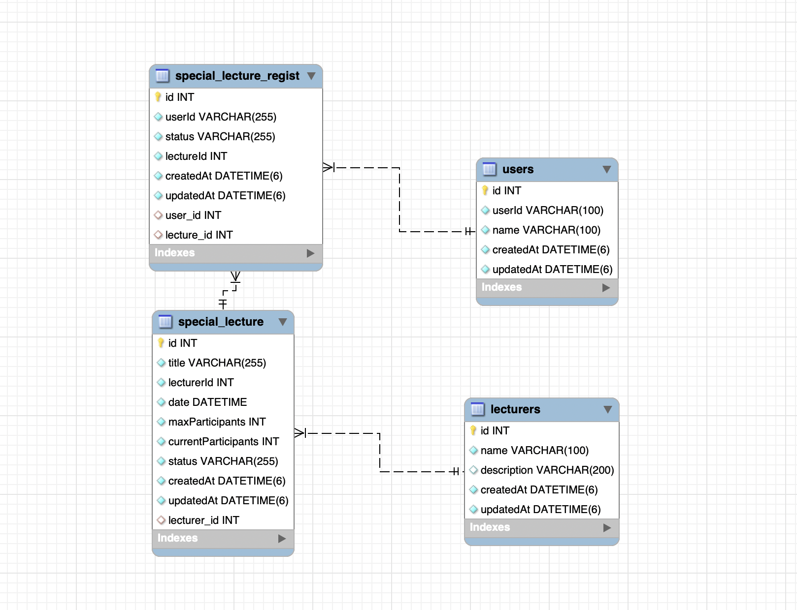

## 특강 신청 시스템

### ERD Diagram

#### 테이블
- special_lecture
  - 특강 정보를 저장한다.
  - 한 강사가 여러 특강을 진행할 수 있다.
  - 수강 신청 인원을 관리할 수 있다.
- special_lecture_regist
  - 유저의 특강 신청 정보를 저장한다.
  - 특강 신청 상태를 관리할 수 있다.
  - 중복 신청을 방지할 수 있다.
- lecturer
  - 특강을 진행할 강사의 정보를 저장한다.
  - 한 강사가 여러 특강을 진행할 수 있다.
- user
  - 특강을 신청할 사용자들의 정보를 저장한다.

#### 테이블 설계 이유 
- 특강 테이블 (special_lecture): 특강별 데이터를 독립적으로 관리하기 위해 설계.
  - 수강 신청 인원 관리: currentParticipants와 maxParticipants 필드를 통해 특강별 참가자 수를 관리.
  - 강사 정보 연결: lecturerId를 통해 강사와 연결하여 강의와 강사를 효율적으로 관리.
- 특강 신청 테이블 (special_lecture_regist): 사용자별 신청 정보를 기록하고 중복 신청을 방지.
  - 유저와 특강 연결: userId와 specialLectureId를 통해 유저와 특강을 연결.
  - 중복 방지: userId와 specialLectureId 조합을 Unique Key로 설정하여 중복 신청을 방지.
  - 신청 상태 관리: 신청 취소나 완료 상태를 기록하기 위한 필드(status) 추가.
- 강사 테이블 (lecturer): 강사 정보를 분리하여 재사용성과 관리성을 높임.
  - 다중 강의 관리: 한 강사가 여러 특강을 진행할 수 있는 구조.
  - 확장성: 강사 정보(소개, 전문 분야 등)를 쉽게 확장 가능.
- 유저 테이블 (user): 특강 신청자의 정보를 관리하고, 다양한 요청 처리에 대비.
  - 특강 신청 정보와 연결: 유저가 신청한 특강을 추적.
  - 확장성: 사용자 인증 및 권한 관리를 추가할 여지를 남김.

#### 테이블 관계
1. 특강1:신청N => 한 특강에 신청 여러개
2. 유저1:특강신청N => 한 유저가 특강 여러개 신청할 수 있음(다른 특강인 경우)
3. 강사1:특강N => 한 강사가 여러 특강 진행
4. 강의신청은 유저아이디와 특강아이디 조합을 유니크로 해 중복을 방지하도록 설계한다.